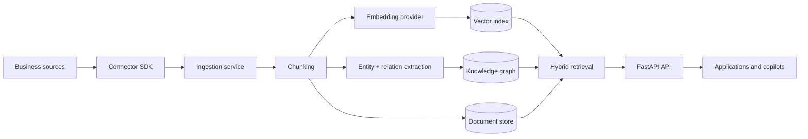

# Universal AI Knowledge Graph

> Maintained by **Raeburn Technologies**, part of **The Raeburn Group**.
>
> Group: https://theraeburngroup.com · Technology: https://technology.theraeburngroup.com · Trust: https://trust.theraeburngroup.com

## Overview

Universal AI Knowledge Graph is an open-source semantic knowledge project for ingesting, normalising and retrieving information across structured and unstructured business sources.

The project is part of the RaeburnAI technology initiative within the wider Raeburn Technologies portfolio.

## Current maturity

**Status: foundation / active development.**

The repository includes a FastAPI service, ingestion and retrieval APIs, local deterministic embeddings, optional OpenAI embeddings, entity and relationship extraction, provenance metadata, health/readiness/metrics endpoints, Docker assets, CI, CodeQL and deployment documentation.

It is not presented as a finished hosted enterprise service. Production use with sensitive data requires stronger identity, role controls, durable storage, managed secrets and data-protection workflows.

## Core capabilities

- Semantic retrieval across business knowledge sources
- Connector SDK and normalised document model
- Chunking and provenance metadata
- Local deterministic embeddings for development
- Optional OpenAI embedding provider
- Entity and relationship extraction
- Hybrid retrieval with graph context
- FastAPI REST API and OpenAPI documentation
- Health, readiness and metrics endpoints
- Structured logging
- Optional API-key protection for private deployments
- Rate limiting and audit-event logging
- Docker and Docker Compose deployment assets
- CI, CodeQL and dependency maintenance configuration

## Architecture



See [`docs/ARCHITECTURE.md`](docs/ARCHITECTURE.md) for implementation detail.

## Quick start

```bash
cp .env.example .env
docker compose up --build
```

API endpoints include:

- `GET /health`
- `GET /ready`
- `GET /metrics`
- `POST /v1/ingest`
- `POST /v1/search`

Local development:

```bash
python -m venv .venv
. .venv/bin/activate
make install
make lint
make typecheck
make test
make build
make docker-build
make run
```

## Configuration

| Variable | Required | Default | Description |
|---|---|---|---|
| `UKG_ENVIRONMENT` | No | `development` | Runtime environment |
| `UKG_API_KEY` | Production yes | empty | Static API key for private deployments |
| `UKG_DATABASE_URL` | Production yes | local Postgres | Database URL |
| `UKG_EMBEDDING_PROVIDER` | No | `local-hash` | Embedding provider |
| `UKG_EMBEDDING_DIMENSIONS` | No | `384` | Local embedding dimensions |
| `UKG_OPENAI_API_KEY` | Only for OpenAI embeddings | empty | OpenAI API key |
| `UKG_MAX_CHUNK_CHARS` | No | `1600` | Maximum chunk size |
| `UKG_CHUNK_OVERLAP_CHARS` | No | `200` | Chunk overlap |
| `UKG_LOG_LEVEL` | No | `INFO` | Logging level |

See [`.env.example`](.env.example) for the authoritative configuration.

## Security & data protection

Current controls include optional API-key authentication, strict request validation, rate limiting, structured logs, audit events, restricted local-development CORS defaults, CodeQL and dependency review.

Before handling sensitive enterprise information at scale, the deployment should add environment-appropriate SSO/OIDC, workspace-level access control, managed secret storage, durable audit storage and deletion/export workflows.

See [`SECURITY.md`](SECURITY.md) and [`docs/PRIVACY_AND_DATA_PROTECTION.md`](docs/PRIVACY_AND_DATA_PROTECTION.md).

Repository controls do not constitute independent security certification or assurance.

## Related published projects

- [RaeburnAI AgentOS](https://github.com/The-Raeburn-Group/RaeburnAI-AgentOS)
- [RaeburnAI Enterprise MCP Server](https://github.com/The-Raeburn-Group/RaeburnAI-Enterprise-MCP-Server)
- [RaeburnAI Business Twin](https://github.com/The-Raeburn-Group/RaeburnAI-Business-Twin)
- [RaeburnAI Workflow Auditor](https://github.com/The-Raeburn-Group/RaeburnAI-Workflow-Auditor)

Only currently published repositories are listed here.

## Roadmap

See [`docs/ROADMAP.md`](docs/ROADMAP.md).

## Contributing

See [`CONTRIBUTING.md`](CONTRIBUTING.md).

## Licence

Apache License 2.0. See [`LICENSE`](LICENSE) and [`NOTICE`](NOTICE).

---

**Raeburn Technologies · The Raeburn Group**
